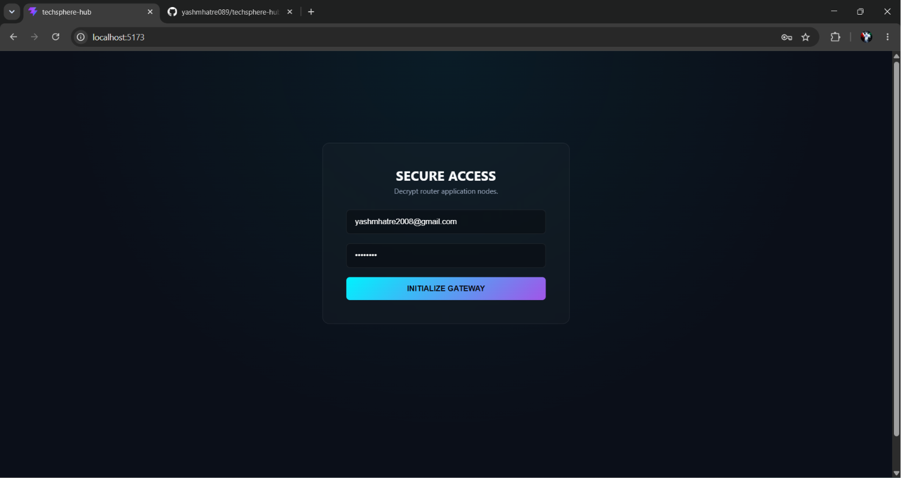
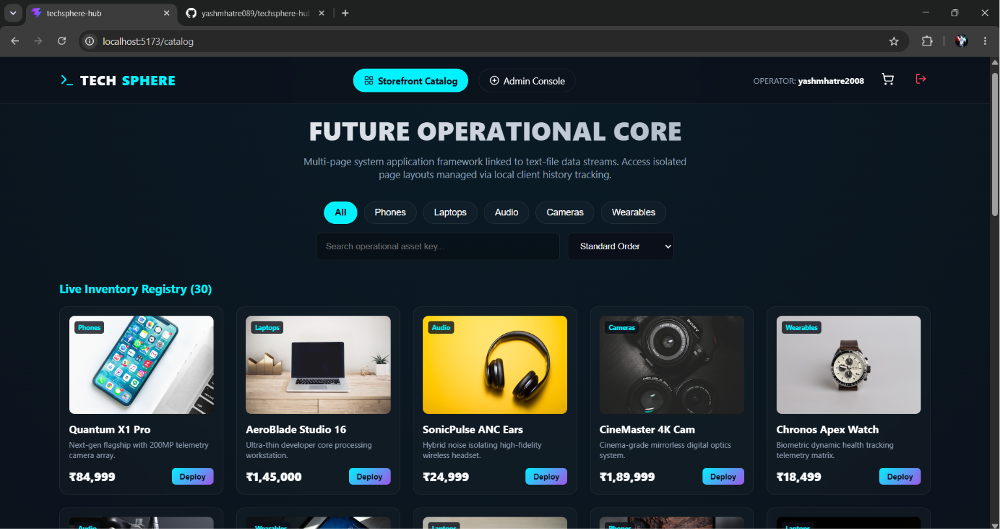
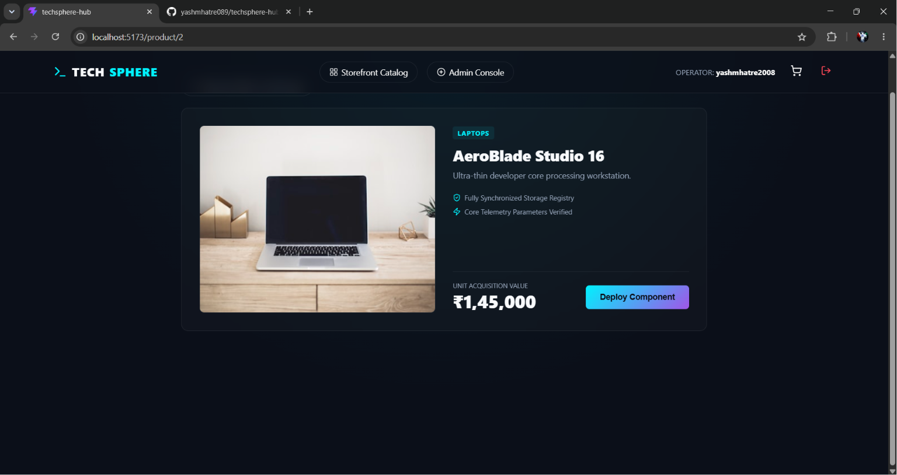
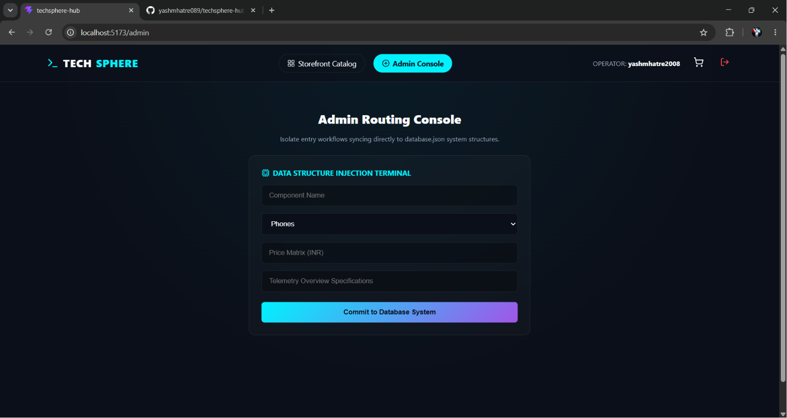
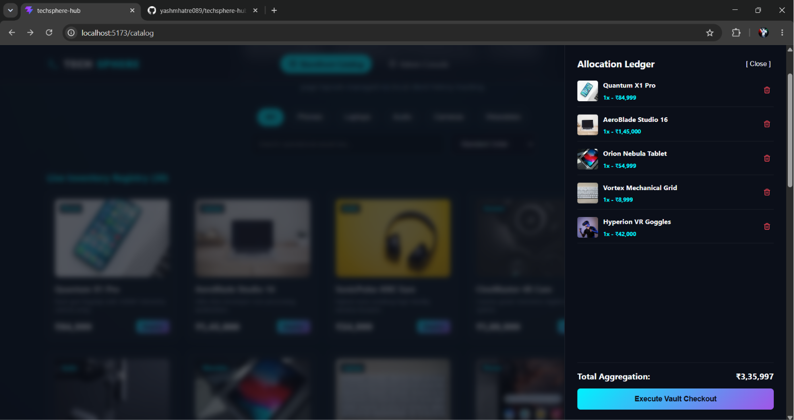

# TechSphere: Future-Ops Edition (Multi-Page Full-Stack Enterprise Layout) 🚀

TechSphere Future-Ops is a modular, multi-page inventory management and purchase allocation platform. Built using **React (Vite)** on the frontend and **Node.js (Express)** on the backend, this application leverages **React Router Dom** to split the architecture into dedicated, isolated browser pathways. 

The backend system performs live, real-time data tracking directly into a flat-file JSON document storage tier (`database.json`), creating complete database utility with high portability and zero external database configuration requirements.

---

## 🖥️ System Multi-Page Interface Journey

Here is the step-by-step visual workflow of the system running across its true browser history routes:

### 1. Secure Access Gateway Route (`/`)
The primary authentication access checkpoint layer. It acts as an operational layout lock screen, requiring operator parameters to decrypt down-stream router infrastructure.


### 2. Live Storefront Marketplace Grid Route (`/catalog`)
The core marketplace overview panel rendering your massive registry list of 30 active premium electronic hardware assets. This view integrates real-time search filtering pipelines and category pill navigation.


### 3. Dynamic Standalone Product Details Route (`/product/:id`)
A dedicated overview workspace generated instantly for each item through dynamic parameter URL tracking. The system extracts the specific item ID from the address bar, reads the server database array, and generates custom item spec dimensions automatically.


### 4. Isolated Administrative Insertion Console Route (`/admin`)
A separate, locked administrative view mapping out the data entry terminal form. Supervisors can use this console page to inject new components safely into the flat text repository.


### 5. Shopping Cart Allocation Ledger Sliding Drawer
The overlay matrix panel that slides out smoothly from the layout on any page context to keep real-time item quantities, individual hardware costs, and combined cost total calculations up to date.


---

## 🛠️ Technological Architecture Stack

- **Frontend Framework Library:** React (Functional Architecture, Hooks Pipeline)
- **Client Routing Engine:** React Router Dom (`BrowserRouter`, `Routes`, `Route`, `useNavigate`, `useParams`)
- **UI Design Layout:** Classic Cyber-Dark System, CSS Variables, Glassmorphism Viewports
- **Vector Graphics Pack:** Lucide-React
- **Project Compiler Bundler:** Vite (Modern Industry Standard Performance Optimizations)
- **Backend Core Infrastructure:** Node.js, Express.js REST API Routing Engine
- **Storage Subsystem Tier:** Flat-file JSON Document Synchronization Framework (`fs` native parser)

---

## 📦 Local Installation & Deployment Protocol

Follow these systematic, detailed instructions to install project dependencies and activate both sides of the full-stack system layout on your local machine:

### 1. Position Terminal Location
Open your project directory workspace inside your VS Code application window.

### 2. Activate the Backend REST API Server Endpoints
Open a new integrated terminal tab pane window inside your VS Code panel view and run:
```bash
cd backend
node server.js